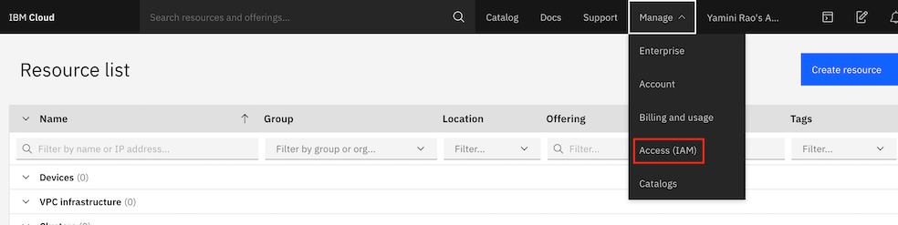
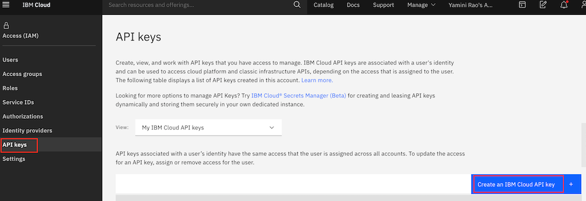
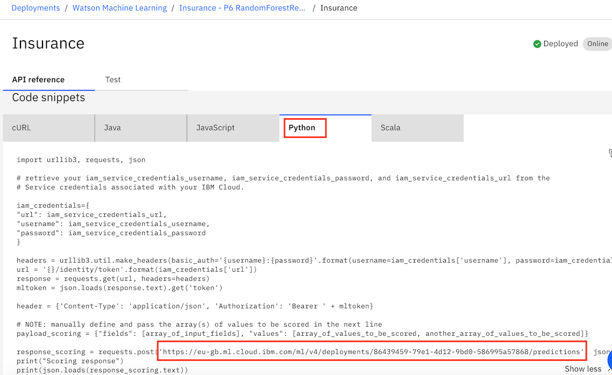
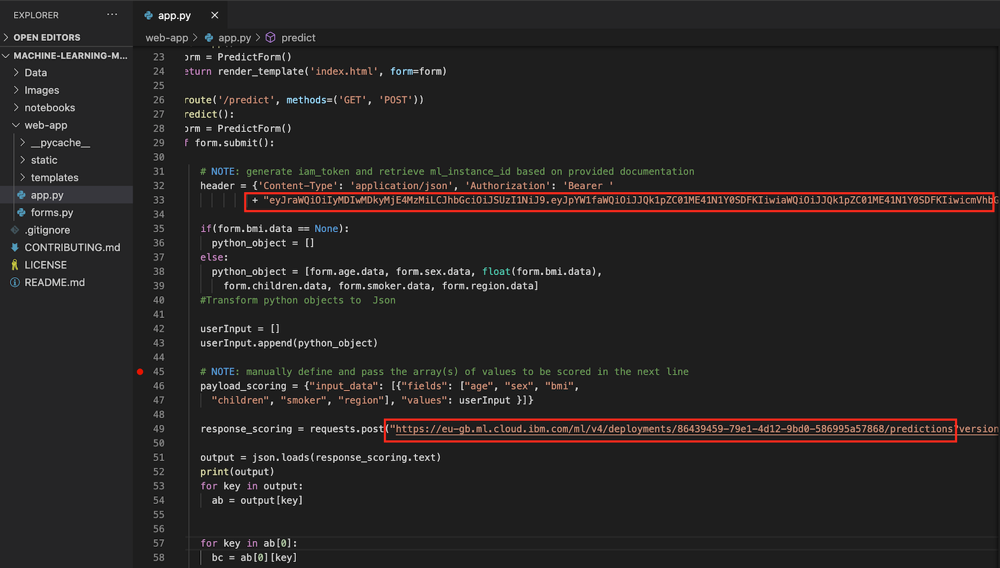

## Run the application

- To run and test your deployed model through a Python-based user-interface, you need to replace the following information within web-app/app.py.

1) Your deployed model's deployment URL, so you can make a POST request.
2) An API key which will be used to generate your IBM Cloud IAM token, to authorize yourself.

## IBM Cloud API key

Generate an IBM Cloud apikey by clicking the Manage --> Access (IAM) option on your top right.



- Click on API keys from the left navigation pane, and select <b> Create an IBM Cloud API key </b> 



-  Once your key is created <b> Copy </b> or <b> Download </b> your key. 

## Get model deployment Endpoint URL 

- Click on your deployed model and under the <b> API reference tab <b> navigate to Python and select the URL to be used in app.py. 
  
  
  

## Generate the access token

- From the command line, type `curl` -V to verify if cURL is installed in your system. If cURL is not installed, refer to [these](https://develop.zendesk.com/hc/en-us/articles/360001068567-Installing-and-using-cURL#install) instructions to get it installed 

- Execute the following cURL command to generate your access token, but replace the apikey with the apikey you got earlier. 

```
curl -X POST 'https://iam.cloud.ibm.com/oidc/token' -H 'Content-Type: application/x-www-form-urlencoded' -d 'grant_type=urn:ibm:params:oauth:grant-type:apikey&apikey=<api-key-goes-here>'
```

## (Windows Users only) - Using Windows 10 and Powershell to generate the access token

- Install python.org Windows distro 3.8.3 from http://python.org - make sure to add the /python38/scripts folder path to the $PATH environment, if you do not, you will get errors trying to run flask (flask.exe is installed to the scripts folder)

- Remove powershell alias for curl and install curl from python3.8

```
PS C:/> remove-item alias:curl

PS C:/> pip3 install curl
```

- Execute curl to get secure token from IBM IAM. Please note that the token expires after 60 minutes. If you get an internal server error from the main query page (The server encountered an internal error and was unable to complete your request. Either the server is overloaded or there is an error in the application), it may be due to the token expiring. Also note that in powershell the continuation character is ‘

```
curl -X POST 'https://iam.cloud.ibm.com/oidc/token' -H 'Content-Type: application/x-www-form-urlencoded' -d 'grant_type=urn:ibm:params:oauth:grant-type:apikey&apikey=<apikey>'
```

## Modify the 'web-app/app.py' file

- Copy and paste the access token into the header in the `web-app/app.py` file. Replace the line`" TODO: ADD YOUR IAM ACCESS TOKEN FROM IBM CLOUD HERE"` with your token.

- Modify the `app.py` file within the `web-app` directory to change the POST request with your deployment ID. The finished line should look like this : 

  

 You are ready to run the application! 
 
 ## Install dependencies, and run the app

Note, this app is tested on this version of Python 3.8.2

Within the `web-app` directory, run the following command: 

```
pip3 install flask flask-wtf urllib3 requests
```

Next, run the following command to start the flask application.

```
flask run
```

## (Windows Users only) - Running the app using Windows 10 and Powershell

- Install flask and dependencies

```
PS C:/> pip3 install flask flask-wtf urllib3 requests

Verify modules have been installed in the 'python38/scripts' folder
```

- Run 'web-ap/app.py' from the local directory using flask

```
PS C:/> set FLASK_APP=app.py

PS C:/> flask run
```

## Run application from browser

- Go to `127.0.0.1:5000` in your browser to view the application. Go ahead and fill in the form, and click on the `Predict`
button to see your predicted charges based on your data. 
